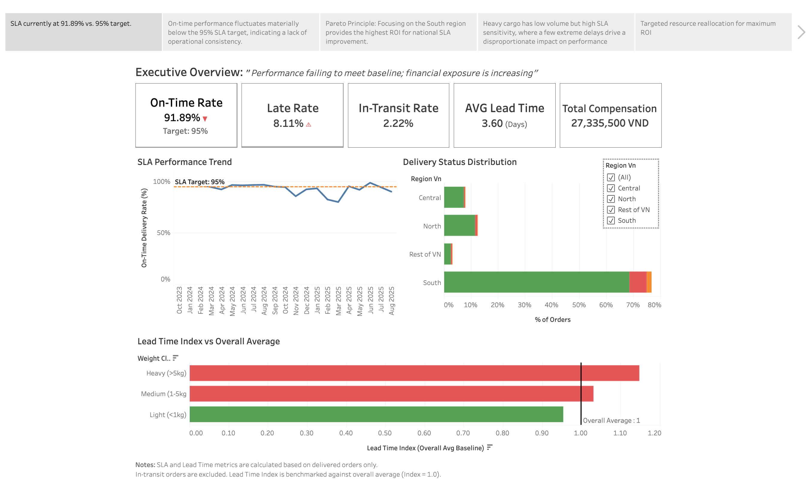

# 📊 Tableau Story: Supply Chain Control Tower 2025

This document provides access to the **interactive Tableau component** of the project.

The Tableau Story presents an **end-to-end analytical narrative** for evaluating
supply chain performance in a **Vietnam 2025 market simulation**, with a focus on
business decision-making.

---

## 🖼️ Dashboard Preview

---

## 🔗 Interactive Tableau Public Link

The story is designed for **executive and business stakeholders**, focusing on
SLA health, root cause analysis, and decision support.

👉 **[EXPLORE THE INTERACTIVE TABLEAU STORY](https://public.tableau.com/views/SupplyChainControlTowerDashboard2025/Story1?:language=en-US&:sid=&:redirect=auth&:display_count=n&:origin=viz_share_link)**

> **Tip:** View in **Full Screen mode** for the best experience.  
> The link opens directly in **Story mode**, which is the intended presentation
> format for this project.

---

## 🧭 Story Structure Navigation

The narrative follows a **Macro-to-Micro analytical approach**, guiding stakeholders
from high-level KPIs to specific operational bottlenecks.

**Story flow:**

1. **Executive Overview – SLA Health**  
   High-level overview of SLA performance versus target.

2. **Performance Trend Analysis**  
   Stability and trend evaluation of SLA and lead time metrics.

3. **Regional Contribution Analysis**  
   Identification of geographic concentration and regional bottlenecks.

4. **Lead Time Bottleneck Diagnosis**  
   Comparative analysis using the *Lead Time Index (LTI)*.

5. **Product Weight Impact Analysis**  
   Root cause validation based on shipment weight classes.

6. **Financial Impact Assessment**  
   Estimation of compensation costs due to late deliveries.

7. **What-if SLA Improvement Simulation**  
   Scenario analysis to evaluate potential performance improvements.

8. **Strategic Recommendations**  
   Data-driven operational and policy recommendations.

---

## 🛠️ Technical Context

- **Data Engine:** SQL (PostgreSQL / Supabase)  
- **Data Model:** Single master analytical view  
  (`vw_localized_supply_chain`) optimized for BI consumption
- **Localization:** 2018 Olist dataset shifted to a **Vietnam 2025 context**
  using SQL `INTERVAL` logic
- **Deep Dive:** Detailed logic is documented in the *Technical Documentation*
  and *Data Dictionary*

---

## 👤 Author Note

This dashboard showcases a complete **SQL → BI → Storytelling workflow**.

I am happy to discuss:
- The methodology behind **Lead Time Indexing**
- The use of **complex LOD expressions** in Tableau
- Design decisions made for executive-facing dashboards

Let’s connect!